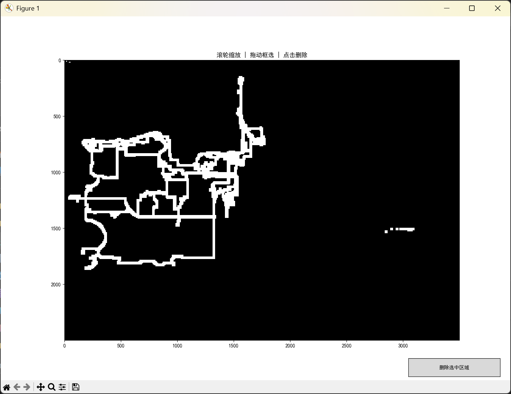
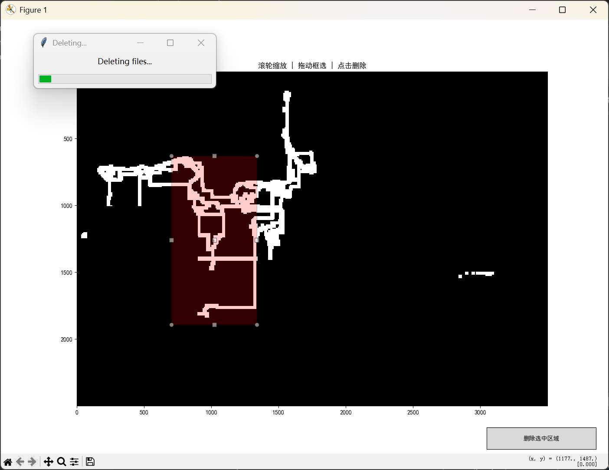

# PZCleaner
A map cleaner for Project Zomboid(B42)  
You can change the language option at the beginning of the main.py.  
`pyinstaller --noconsole --onefile --name PZCleaner_zh --add-data "strings_zh.json;." main.py`  
This project supports a block length of 3500, which means it can support RV Interior or other RV mods.  

